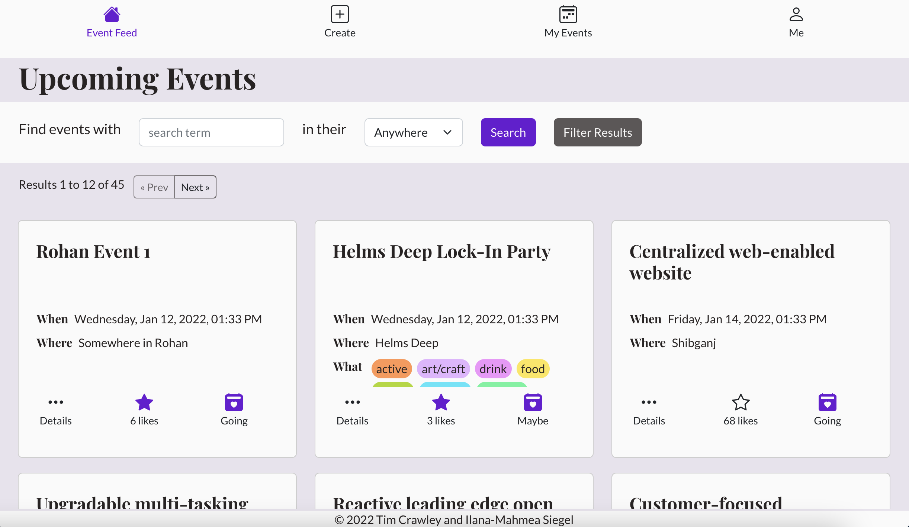
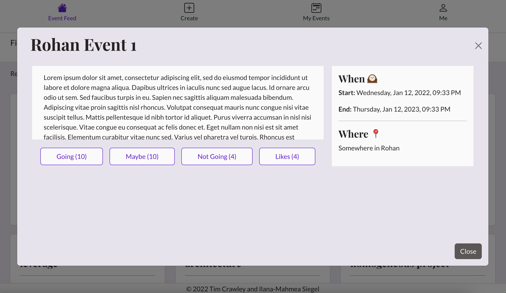

# BeHere

## Authors

[Tim Crawley](https://github.com/tcrawley2) and [Ilana-Mahmea Siegel](https://github.com/m-siegel/)

## Milestones for class:

- **Proof of 60% progress as of Nov 15: [release version 0.0.0, tag nov15_60%](https://github.com/m-siegel/BeHere/releases/tag/nov15_60%25)**. This is very much a draft -- we were feeling things out and trying to encounter bugs and gaps in knowledge early, so we focused on "proof of concept" type versions, not near-final-draft versions. We got React router working and routing from the front to the back, but just in a way that tested whether or not we could do it. We merged our branches just before this and hadn't yet figured out how we were going to handle redundant code, or the TODOs and bugs in the code. **You can see the merged version on the `main` branch, Tim's work on the `tim` branch and Ilana-Mahmea's work on the `mea` branch.**

- **Proof of 80% progress as of Nov 22: [release version 0.0.1, tag v0.0.1-TA-nov22_80%](https://github.com/m-siegel/BeHere/releases/tag/nov22_80)**.

- **Project 3 release: [tag version 1.0.0](https://github.com/m-siegel/BeHere/releases/tag/1.0.0)***

## Other notes for TAs:

- The styling for some components is done in other components' stylesheets. This is because components may be reused across different other components/pages, which may require different styling. For example, while the general shape of EventPreview components does not change, some styling, like the colors, may differ depending upon the parent component, so that styling is done in the stylesheet for whichever component is controling that particular EventPreview.

## What

A fullstack web application for sharing events within an organization. Users sign up with their organization email, which allows them to post events for other organization members to see. Users can see, upvote and RSVP to events that are posted within their organization.

We created this site as project for our [Northeastern University CS5610 Web Development](https://johnguerra.co/classes/webDevelopment_fall_2022/) class in fall 2022.

## Objectives

- To become familiar with React and improve our skills with Node, Express, MongoDB, and HTTP requests.
- To create a working fullstack site that we and others could use to share events within our organizations.

## Technologies

- _Figma_ – for planning and page mock-ups.
- _React_ and _JSX_ - for everything in the front end, including front-end routing.
- _CSS_ – for page styling.
- _Bootstrap_ – for more page styling.
- _JavaScript_ – For all the back end code.
- _Express_ - for app structure and routing.
- _Node_ - for the back end environment.
- _Passport_ and _Passport-Local_ - for user authentication.
- _Express-Session_ - for storing persistent data.
- _Bcrypt_ - for hashing and comparing passwords.
- _MongoDB_ - for a database to store user and flashcard data.

## How to Use BeHere

You can visit our deployed site at [be-here.onrender.com](https://be-here.onrender.com/) or run it locally on your own computer.

### Run Locally with Git

These instructions use yarn commands. You can use the npm equivalents if you'd prefer.

1. Clone this repository.
2. Cd to the 'BeHere' directory and run 'yarn install'. This will install the depencies for both the back-end and front-end, and will create a static build of the front-end.
3. To create a database, install mongodb locally and run the local server in the background. It should be set up to run on localhost:27017. Then, from the 'BeHere' directory, run 'yarn run initMockDb'. This will create a be-here database on your local MongoDB connection with user and event collections, each pre-populated with 1k+ documents.
4. Run 'yarn start'.
5. In the web browser of your choice, go to [http://localhost:3001/](http://localhost:3001/)
6. Enjoy!

## A Peek at our Design Process

For a look into our design process, you can check out the links below or head over to the [design-docs folder](https://github.com/m-siegel/BeHere/tree/main/design-docs).

- [Front-end design on Figma](https://www.figma.com/file/QOl1RSMSOqAbVQlL2AyFZ0/Project-3?node-id=0%3A1&t=83R8VOtuitiSVERk-0)
- [Pictures of each of the Figma design pages](https://github.com/m-siegel/BeHere/tree/main/design-docs/Figma-designs)
- [User Stories](https://docs.google.com/document/d/1jSwcehOhz0aGGsGV_AzXpy_ga3QOUyMMBPYmO0Uwqso/edit?usp=sharing)
- [Project Overview presentation slides](https://docs.google.com/presentation/d/1AIoXCkqrgKIH0WkupYCgs28NksLDtNRU-kLlBTQW-GM/edit?usp=sharing)
- [Demonstration video](https://youtu.be/UdZ8jQl9-rA)

## A Glimpse of our Site

We encourage you to explore our site yourself, but here are a some screenshots of it.

#### Landing Page

#### Register Page

#### Login Page

#### Home Page

#### Event Details Page

#### Edit Event Page

#### Dashboard Page

#### User Settings Page

#### Narrow views of some pages

  
